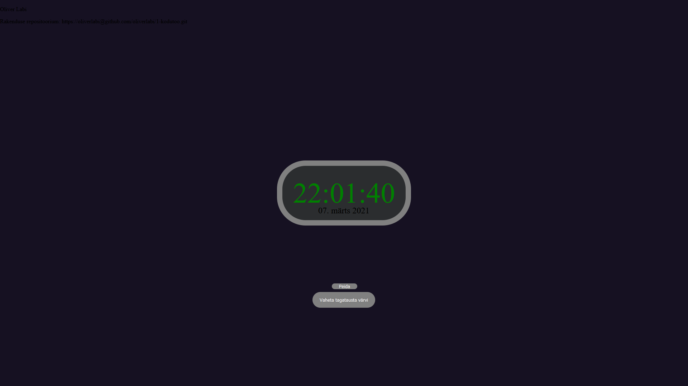
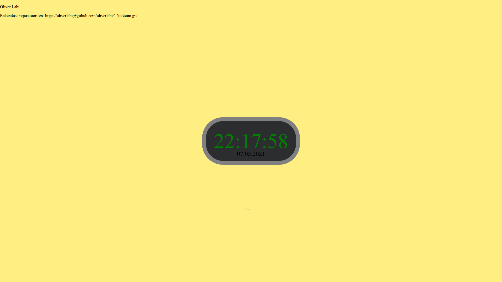

Autor: Oliver Labi

Funktsionaalsus

Lehel on digitaalne kell, mis näitab arvutiaja järgi kella.

Kella all on kuupäev, mille formaati saab muuta kuupäevale peale vajutades.

Lisaks on kella all kaks nuppu: "Peida" ja "Vaheta tagatausta värvi".

Peida nupuga saab peita mõlemad nupud ära. "Peida" nupp muutub "Ava" nupuks läbipaistva tagataustaga ning läbipaistva musta kirjaga, et uuesti nuppe nähtavale tuua.

"Vaheta tagatausta värvi" nupp muudab tagatausta värvi iga kord peale vajutades erinevaks listi asetatud värviks. Kui listis värvid otsa saavad, siis algab värvide ring otsast peale.

