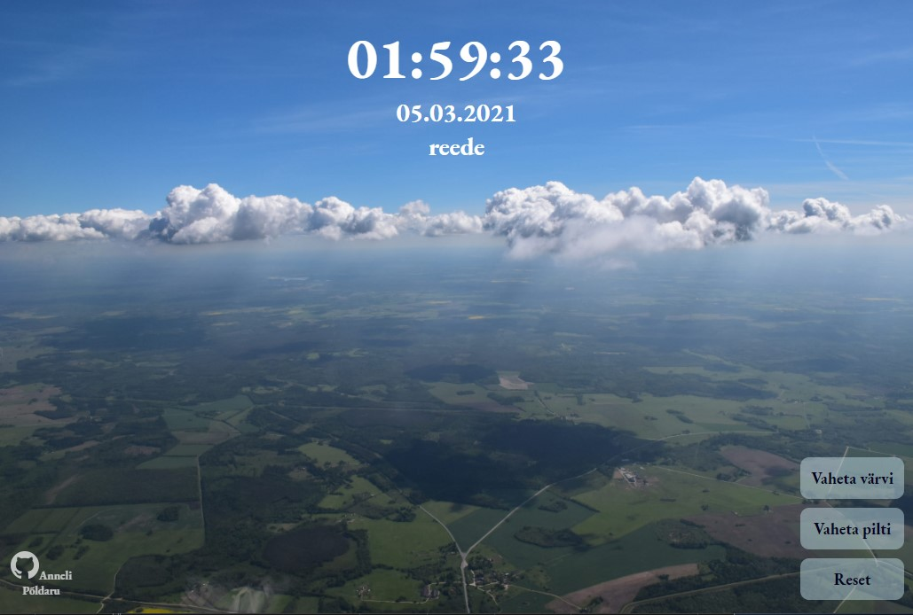
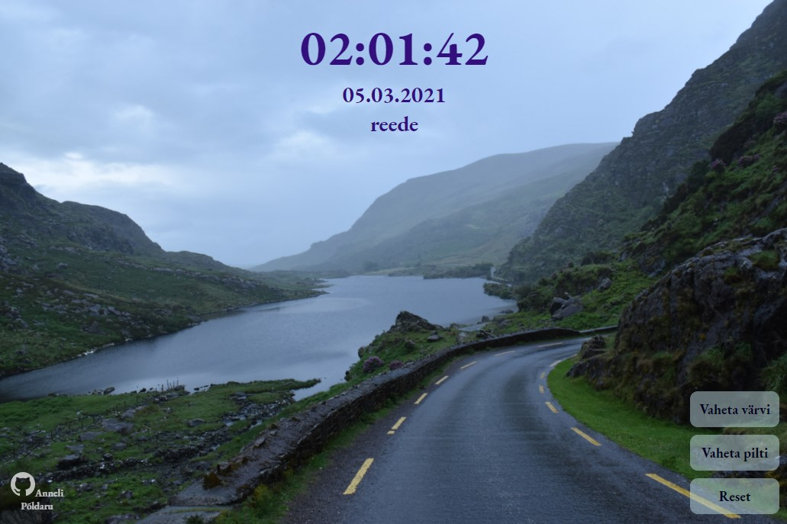
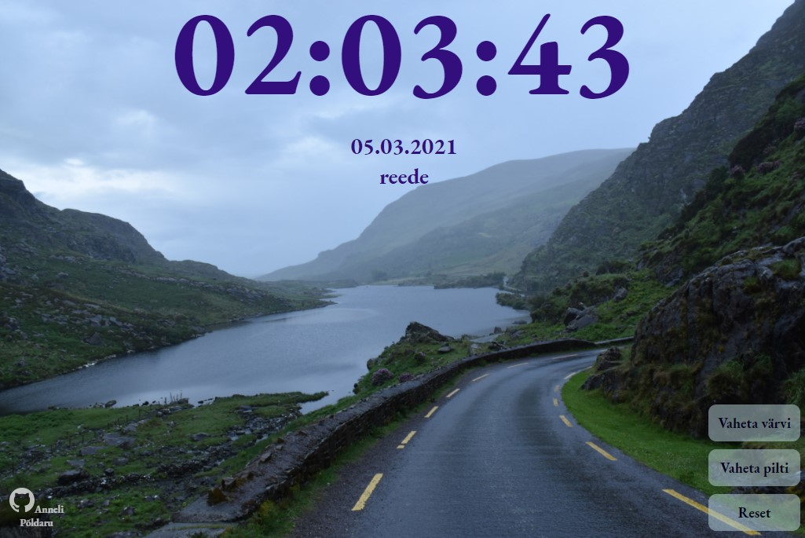
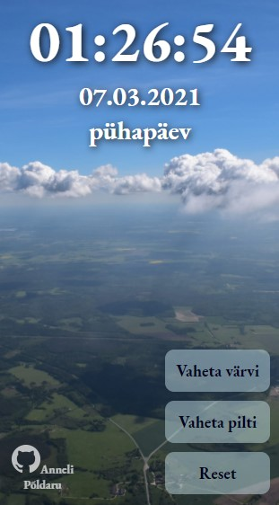
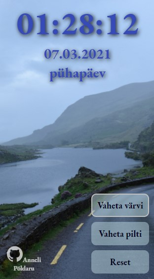

# Autor: Anneli Põldaru
 [http://www.tlu.ee/~annelip8/eesrakendused/homework/clock/](http://www.tlu.ee/~annelip8/eesrakendused/homework/clock/)
 
## Funktsionaalsused_1
* Hiirega nädalapäeva kohale jõudes nädalapäeva enam ei näidata
    * Mobiilses seadmes tuleb sama tulemuse saamiseks nädalapäeva peal "klikata"
* Kellaaeg muutub topeltkliki peale suuremaks (juhul, kui brauser on laiem > 615px). Uuesti topeltklikkides taastub algne suurus.
* Nupu `Vaheta värvi` abil määratakse kellaajale ning kuupäevale (sh nädalapäevale) suvaline värvitoon
* Nupu `Vaheta pilti` abil määratakse uus taustapilt
* Nupu `Reset` abil määratakse elementidele algupärane kujundus
 
## Funktsionaalsused_2
* Veebirakendus töötab. Näitab kella, kuupäeva, nädalapäeva ja aastat.
* Vastavalt kasutaja tegevusele on võimalik muuta **kolme** lauakella atribuuti muuta:
* Kasutatud on eventListener'e ja funktsioone.
* Kell on originaalne ning kasutajaliides on maitsekalt kujundatud kasutades CSS-i - on ise kirjutatud.
* Autori ees- ja perenimi on lehel välja toodud
* Lehel on viide rakenduse repositooriumile
* `README.md` failis on välja toodud autori nimi, ekraanipilt rakendusest ja kirjeldatud funktsionaalsus
 
## Kuvatõmmised

## Mobiilse vaate kuvatõmmised

  
   

