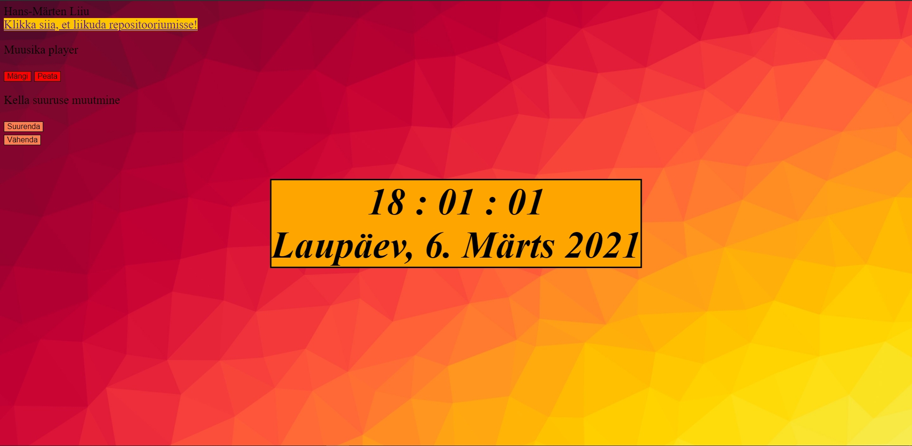
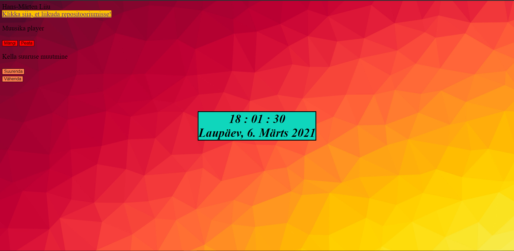
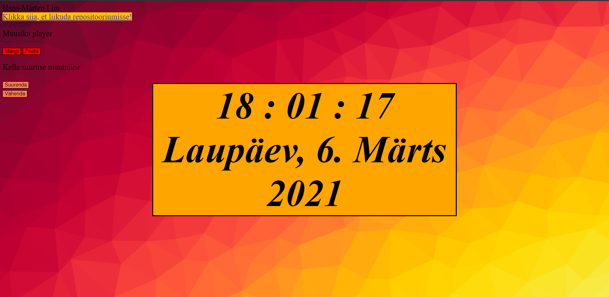

# Autor: Hans-Märten Liiu
 [http://www.tlu.ee/~hm4543/1-kodutoo/clock.html](http://www.tlu.ee/~hm4543/1-kodutoo/clock.html)

## Funktsionaalsused_1
* Tehes kellal klikk, randomiseeritakse kellale uus värv.
* Saab kuulata relaxing muusikat, kui panna muusika playerist muusika mängida. Muusika saab ka peatada.
* Kella suuruse muutmiseks on kaks nupukest. Üks suurendab kella suurust 5px võrra ja teine vähendab kella suurust 5px võrra.

## Kuvatõmmised

