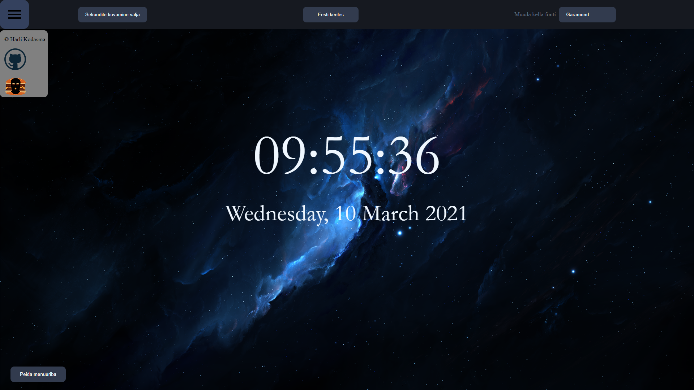

# 1. kodutöö

## Autor ja veebileht

Autor: Harli Kodasma  
Rakendus on kättesaadav siit: http://www.tlu.ee/~harli17/kodutoo1/clock.html

## Funktsionaalsus

Lehele minnes kuvatakse _dark theme_ eeskujul kellaaeg koos sekunditega ja täielik kuupäev, sh nädalapäev.  
Kasutajal on võimalik teha järgnevaid muudatusi:
* Lülitada nupuvajutusega sekundite kuvamine sisse/välja
* Muuta nupuvajutusega kuupäeva keelt: valida on inglise ja eesti keele vahel
* Valida _dropdown_ menüüst omale meelepärane font, milles tahetakse kella vaadata
* Peita/kuvada nupuvajutusega kogu taskbar, kus kõik eelpool nimetatud funktsionaalsus asub - et saaks täisekraanil vähemate segajatega kella näha.  

Lisaks on loodud _burger dropdown_ menüü, mille peale hiirega minnes avaneb pisike aken. Aknas kuvatakse autori nime ning kahte ikooni. Githubi logoga ikoonile vajutades avatakse uus _tab_ rakenduse repositooriumile. Teisele ikoonile vajutades avatakse uus _tab_ veebiprogrammeerimise kursuse kodulehele (see asub greeny serveris ning on seega kättesaadav ainult läbi tunneli) ning mängitakse lühike helifail.

## Ekraanipildid rakendusest

### Muutmata avavaade

### Lülitatud välja sekundite kuvamine, pandud kell inglise keelde, muudetud fonti ja peidetud menüüriba

### Muudetud fonti, pandud kell inglise keelde ja mindud hiirega dropdown menüü nupu peale

